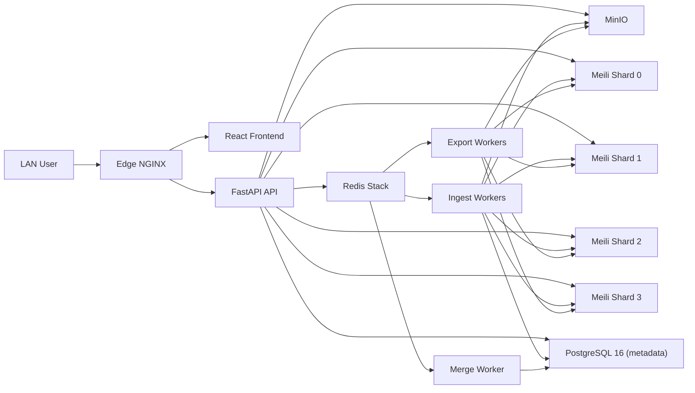

# VortexVault v2 - Maximum Performance Edition

VortexVault v2 is a streaming ingestion + sharded search platform designed for very large TXT combo datasets on a single high-spec Proxmox host.

## Goals
- Ingest 1TB-class files with strict streaming (no full-file RAM load).
- Keep PostgreSQL small (metadata only).
- Deliver low-latency search with typo tolerance, prefix matching, and filters.
- Support resumable ingest with checkpoints.
- Export exact line-limited search results to compressed Parquet (zstd).

## Architecture
- Backend: FastAPI (async), SQLAlchemy 2, Pydantic v2.
- Workers: Celery with isolated queues:
  - `ingest` (high parallel)
  - `merge` (serial safety path, concurrency=1)
  - `export` (async export jobs)
- Queue + Dedupe: Redis Stack (`BF.ADD` + `PFADD`)
- Raw/Object Storage: MinIO (raw upload + parquet export objects)
- Metadata DB: PostgreSQL 16 (jobs/metrics only)
- Search: 4 Meilisearch shards + hash routing + federated query fan-out
- Frontend: React 19 + TypeScript + TanStack Query (real-time polling UI)
- Edge: NGINX reverse proxy (LAN entrypoint)



## Repository Layout
- `backend/` FastAPI + Celery + pipeline services.
- `frontend/` React dashboard.
- `docker-compose.yml` full production-like single-host topology.
- `docker-compose.local.yml` local dev overrides.
- `docker-compose.prodlocal.yml` production-like worker overrides.
- `docker-compose.lite.yml` low-resource local override (single search shard).
- `deploy/` edge proxy and MinIO bootstrap scripts.
- `scripts/` preflight + benchmark helpers.
- `docs/SETUP_SERVER_PRODUCTION_MM.md` full server setup (step-by-step commands).
- `docs/SETUP_LOCAL_LITE_MM.md` lightweight local test setup (step-by-step commands).

## Quick Start (Local)
1. Prepare env:
```bash
cp .env.local .env
```
2. Start stack:
```bash
docker compose -f docker-compose.yml -f docker-compose.local.yml up -d --build
```
3. Open UI:
- App: `http://localhost:8000`
- Flower: `http://localhost:5555`
- MinIO console: `http://localhost:9001`

4. Health check:
```bash
curl -s http://localhost:8000/health
curl -s http://localhost:8000/api/v2/dashboard
```

## Quick Start (Local Lite)
```bash
./scripts/lite_up.sh
```
Stop:
```bash
./scripts/lite_down.sh
```

## Production-Like Preflight
```bash
./scripts/preflight_prodlocal.sh
```

## Ingestion Flow
1. Upload raw file to MinIO bucket `raw-combos` (object key under `raw/...`).
2. Create ingest job:
```bash
curl -sS -X POST http://localhost:8000/api/v2/ingest/jobs \
  -H 'Content-Type: application/json' \
  -d '{"source_bucket":"raw-combos","source_object":"raw/big-file.txt","auto_merge":true}'
```
3. Track progress:
```bash
curl -sS http://localhost:8000/api/v2/ingest/jobs/<job_id>
```

Ingest checkpoints are persisted with byte offsets and can be resumed from the last checkpoint.

## Search API
```bash
curl -sS -X POST http://localhost:8000/api/v2/search/query \
  -H 'Content-Type: application/json' \
  -d '{"query":"gmail.com","prefix":true,"typo_tolerance":true,"limit":100}'
```

## Export API
```bash
curl -sS -X POST http://localhost:8000/api/v2/exports \
  -H 'Content-Type: application/json' \
  -d '{"query":"gmail.com","line_limit":100000}'
```
Then poll:
```bash
curl -sS http://localhost:8000/api/v2/exports/<export_job_id>
```
When completed:
```bash
curl -sS http://localhost:8000/api/v2/exports/<export_job_id>/download
```

## Throughput/Latency Benchmarks (Expected Range)
Hardware baseline: single Proxmox host, `32+ vCPU`, `128GB+ RAM`, `high-end NVMe`.

- Search P95 (hot path, selective filters): `15-50ms`
- Search P95 (broad query): `40-120ms`
- Ingest throughput (clean text, minimal malformed rows): `120k-450k rows/sec` total
- Export (1M rows parquet zstd): often `20-90 sec` depending on query selectivity and shard pressure

These are practical ranges, not hard guarantees. Tune worker counts based on live IO/CPU saturation.

## Proxmox Resource Guidance (Single Host)
- VM/LXC split recommendation:
  - `edge`: 1-2 vCPU, 1-2GB RAM
  - `app/api + workers`: 16-24 vCPU, 32-64GB RAM
  - `postgres`: 8-12 vCPU, 24-48GB RAM, dedicated NVMe
  - `redis + minio`: 4-8 vCPU, 8-16GB RAM
  - `meili shards`: 4 shards, each 2-4 vCPU + 8-16GB RAM + dedicated NVMe volume

Use separate NVMe-backed volumes for:
- Postgres data
- MinIO object data
- Each Meili shard data

## Tuning Priorities
1. Increase `INGEST_WORKER_CONCURRENCY` first, until DB or Meili saturates.
2. Keep `MERGE_WORKER_CONCURRENCY=1` for deterministic finalization.
3. Use `INGEST_BATCH_DOCS` in `20k-50k` range.
4. Increase `PG_MAX_WAL_SIZE` and checkpoint interval under sustained ingest.
5. Watch shard imbalance; rebalance by increasing shard count only if required.

## Monitoring
- Queue/worker visibility: Flower (`:5555`)
- API-level status: `/api/v2/dashboard`
- PostgreSQL: `pg_stat_activity`, `pg_stat_bgwriter`, WAL size growth
- Redis: memory and BF/HLL cardinality trends
- Meili: per-shard indexing/search response behavior
- MinIO: object count and capacity

## Utility Scripts
- `scripts/preflight_prodlocal.sh` bring up and verify production-like profile.
- `scripts/benchmark_matrix.sh` run ingest benchmark jobs for object keys.
- `scripts/search_load_test.sh` run concurrent search latency sampling.
- `scripts/export_verify.sh` run export and download parquet artifact.

## Important Notes
- Legacy v1 code remains under `app/` for reference only.
- v2 runtime uses `backend/` and `frontend/` only.
- For very large files, prefer direct multipart upload to MinIO then submit object key to ingest API.
